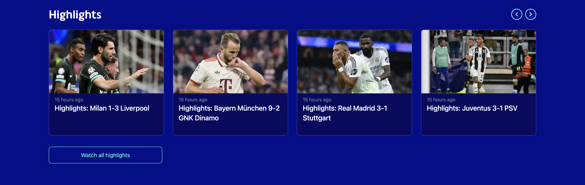

# UEFA CHAMPIONS LEAGUE CLONE

### The most famous Football Competition

## UEFA CHAMPIONS LEAGUE CLONE - TECH STACK

<p align-items="center" justify-content="center">
  
</p>

* #### UCL Home page


* #### UCL Highlights


* #### UCL Table


* #### UCL Footer


The project was built using [React.js](https://react.dev/) and [Next.js](https://nextjs.org/) with [NPM](https://www.npmjs.com/) as our package manager.

As for the UI, we've used [Shadcn-ui](https://ui.shadcn.com/) that uses [Radix](https://www.radix-ui.com/) along with [TailwindCSS](https://tailwindcss.com/).

These are the steps to execute our project:

- To run in Development mode we use the command:

```javascript
npm run dev
```

# License
© Done with a lot of &#10084; by Hugo Ramon Pereira -> [Portfolio](https://hugoramonpereira.dev/) -> [LinkedIn](https://www.linkedin.com/in/hugo-ramon-pereira/) 🇧🇷 .
